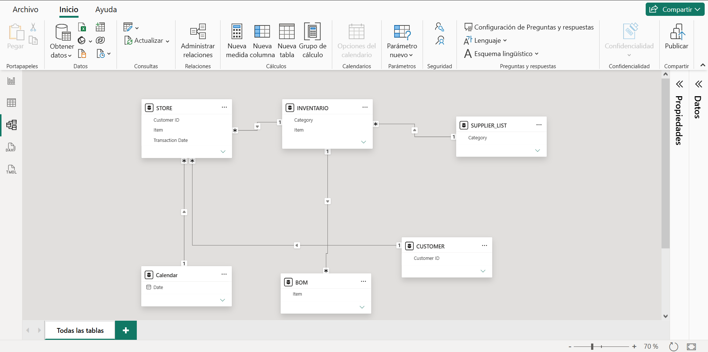

# **S&OP & B2B Supply Chain Optimization Model**

Este proyecto transforma un registro transaccional plano de ventas (12.575 registros en 3 años de historial) en un **modelo de planeación de ventas y operaciones (S&OP)**. Tras un análisis exploratorio, se identificó que el conjunto de datos no corresponde a un retail tradicional (B2C), sino a una **red de distribución B2B** con alta recurrencia (25 nodos/clientes).

El objetivo principal de este repositorio es mostrar cómo pasar de la estadística descriptiva a la **prescripción operativa**, conectando la demanda proyectada con la planificación de requerimientos de materiales (MRP), la simulación de coberturas de inventario y el control de tiempos de ciclo con maquiladores externos.

## Resumen ejecutivo
**Autor:** Javier Aponte
**Fecha:** 07/10/2026
**Estado del proyecto:** Completado
**Herramientas utilizadas:** DAX, Power BI

## Business architecture (Data model)
Para estructurar la red de valor, el proyecto debe abandonar el modelo de tabla única y desarrollarse bajo un esquema de estrella relacional, simulando así un entorno de un ERP:
* **Store:** Transacciones limpias, conservando únicamente las cantidades y el ID del producto, eliminando columnas de fecha y métodos de pago irrelevantes para manufactura.
* **Calendar:** Tabla generada en DAX para habilitar inteligencia de tiempo (Time Intelligence).
* **Inventario:** Simulación de parámetros logísticos por SKU (Stock de mínimo, Punto de reorden).
* **BOM:** Estructura de componentes y factores de conversión para explosión de necesidades.
* **Supplier List:** Asignación de líneas de producción a terceros, definiendo Lead Times (tiempos de entrega) y Yield (rendimiento de producción).

